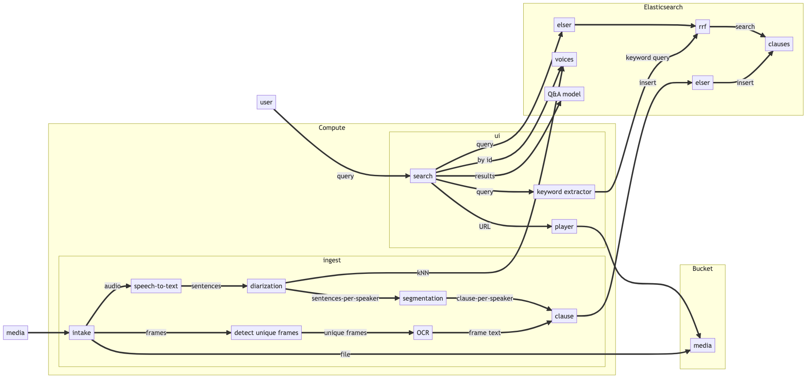

# In Their Own Words

An exemplary project to demonstrate the art-of-the-possible for search of informative video using off-the-shelf ML models, Elasticsearch ELSER semantic search, Elasticsearch non-text-media kNN search, and Elasticsearch Reciprocal Rank Fusion (RRF)!

## Background

Modern organizations, from large enterprises to school districts, share a lot of pertinent and timely information through video content (e.g., Town Halls, Tutorials, Webinars, Board Meetings). Typically such content addresses a wide range of topics within a given video, with each topic of interest only to a specific subset of the audience. Without a good intra-video search option, viewers are forced to consume such content linearly. At best, this potentially wastes a viewer's valuable time; at worst, it creates enough of a barrier to consumption that pertinent information (which could be a catalyst to further productivity) goes unwatched.

In general, few options exist to make informative, often private (e.g., internal use only), video practically searchable. Some existing projects summarize video content using a public Speech-To-Text (STT) engine and LLM (e.g., as offered by OpenAI), and then offer search on top of the summarized output. Use of such services, however, potentially puts private information at risk for public exposure. Further, and arguably more importantly, speakers in informative video are generally:
* subject matter experts
* well-spoken
* already producing expertly-curated summarized content

Adding a LLM to summarize their carefully chosen words can easily skew their intended meaning. As an example, consider a company townhall meeting which includes a discussion from the VP of HR regarding a layoff: the words spoken have been carefully selected and their nuance matters. This project (as the name implies) intentionally forgoes such paraphrasing and instead lets subject matter experts speak for themselves.

# Concept of Operations

## Ingest

1. Convert audio to paragraphs
    1. Extract audio from file
    2. Generate text sentences from speech (STT)
    3. Assign speakers to sentences (diarization)
        1. Generate embedding for voice
        2. Search for embedding in Elasticsearch using kNN
        3. If no match, create new voice record in Elasticsearch
    4. Group sentences
        1. By speaker
        2. By "thought" (using sentence similarity model)
        3. Split if greater than ELSER token limit
2. Convert slides (if present) to keywords
    1. Extract video frames from file
    2. Compare frames looking for unique frames
    3. Apply Optical Character Recognition (OCR) to unique frames
    4. Keep only unique, high-confidence frame text
3. Align and merge extracted frame text with "thoughts" (from step 4) to create clauses
4. Store clauses in Elasticsearch

## Search

1. Extract keywords from query
2. Submit query (ELSER against clause text) and keywords (BM25 against clause text and associated frame text) to Elasticsearch for a hybrid query (this is used to obtain a minimum score; if it is below a threshold, return no results)
3. Submit query (ELSER against clause text) and keywords (BM25 against clause text and associated frame text) to Elasticsearch for a RRF query
4. Run RRF results through a Q&A model (running on Elasticsearch ML nodes) to highlight answer

# Architecture



# Deployment

## Hugging Face Models

Some of the models require a [Hugging Face](https://huggingface.co) token and acceptance of respective user agreements. 

1. [Create a Hugging Face account](https://huggingface.co/join)
2. [Generate a token](https://huggingface.co/settings/tokens)
3. Accept the user agreement for the following models: [Segmentation](https://huggingface.co/pyannote/segmentation), [Voice Activity Detection (VAD)](https://huggingface.co/pyannote/voice-activity-detection), and [Speaker Diarization](https://huggingface.co/pyannote/speaker-diarization).

## Elastic Instance

You will need a modern Elastic (>= 8.9) instance with sufficient ML resources (at least 4GB of RAM) to support this demo. You can start a 2 week free trial of Elastic Cloud [here](https://cloud.elastic.co/registration). Be sure to select "4 GB RAM" for the Machine Learning instance type. When you create the instance, you will be provided a password for the `elastic` user; make note of it. Additionally, from the Deployments page, you will need the endpoint of your Elasticsearch instance.

## Media Storage

Because many content sites do not permit anonymous, external playback of video, this demo will upload your ingested video to  (s3, gcs) cloud bucket storage to enable the UI to later play it back. You will need to setup the bucket with an IAM allowing full permissions from your compute instance. Additionally, on GCS, we use signed URLs which requires a corresponding service key to generate. You will need to create a service key and store it in `env/google_service_key.json`.

## Compute Instance(s)

You can optionally run media ingest separately from the UI. This would enable you to run the more expensive GPU-enabled media ingest on-demand, with the UI running on a lesser (free!) compute tier. This documentation assumes a combined ingest and UI server.

On AWS, a `g4dn.xlarge` EC2 instance type with a single NVIDIA T4 Tensor Core is appropriate. On GCP, a `n1-standard-4` (4 vCPU, 2 core, 15GB RAM) with a single Tesla T4 GPU is appropriate.

 I found these instance types provided a good balance between cost (~ 0.50 per minute) and CPU/GPU power (processing ~1 hour of video in about 10 minutes). That said, this demo should run on any modern CUDA-powered environment. I created a 256GB root volume to contain the requisite ML models and temporary media. The installation script assumes use of Ubuntu 20/22 LTS. On GCP, I used an image that had the nvidia drivers pre-installed.

# Setup 

## Download the project

```
cd /home/ubuntu
git clone https://github.com/ty-elastic/intheirownwords.git
```

## Setup environment vars

Create a file named `env.vars` in the `intheirownwords/env` directory on the compute instance with the following environment variables (do not wrap the values in quotes):

```
#for media storage (one or the other)
AWS_S3_BUCKET=
GCP_GCS_BUCKET=

#for huggingface models
HF_TOKEN=

#for export to elasticsearch
ES_ENDPOINT=
ES_USER=
ES_PASS=

#the base URL of server, externally
BASE_URL=
```

## Setup authorization

Create a file name `users.yaml` in the `intheirownwords/auth` directory on the compute instance. Follow the instructions [here](https://github.com/mkhorasani/Streamlit-Authenticator?ref=blog.streamlit.io).

## Install Dependencies

`setup/ubuntu.sh` will setup dependencies on your EC2 instance to run the demo using docker containers. `setup/es.sh` will setup requisite dependencies within Elasticsearch.

```
cd /home/ubuntu/intheirownwords/setup
./ubuntu.sh
./es.sh
```

After install, and before use, please logout and log back into your EC2 instance to ensure docker is available without use of sudo.

If you intend to further develop this demo, you can run `./ubuntu.sh -d true` which will install the tools required to run directly on the host.

## Run

We use docker compose for orchestration. From `intheirownwords`, run `docker-compose up --detach`.